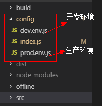
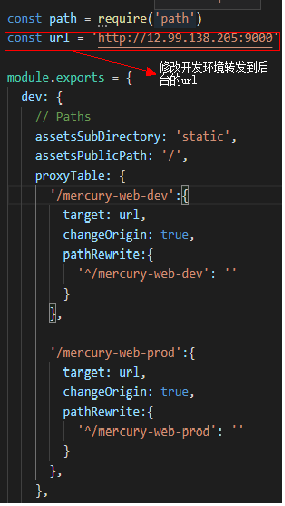
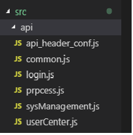
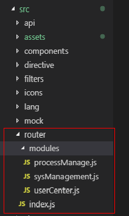
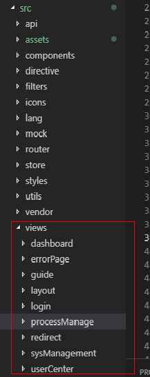
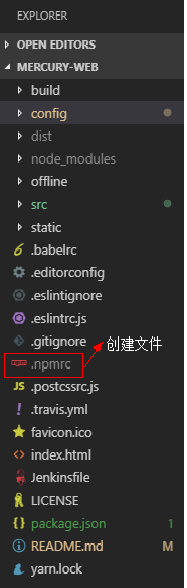
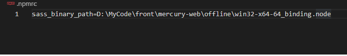
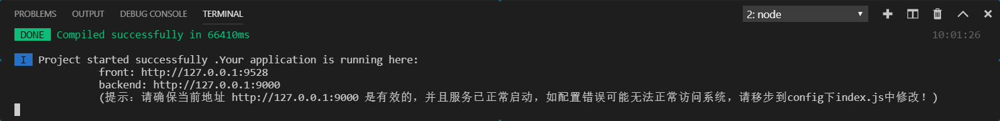
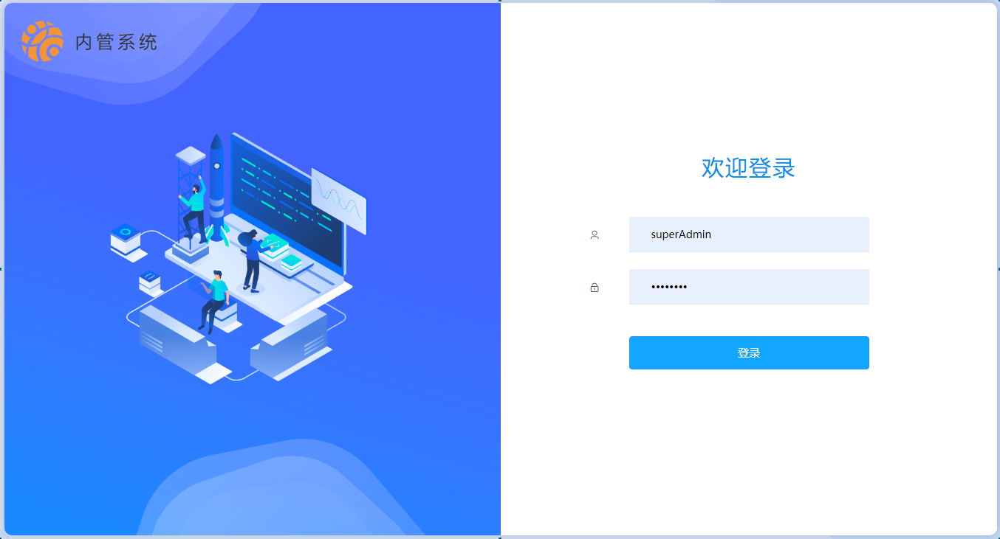

## 速汇盈demo系统前端工程
----

### 项目介绍

```
速汇盈demo系统前端模板：
速汇盈demo系统前端模板，主要包括，“首页”，“引导页”，“用户设置”，“系统管理”等模块
```

----
### 工程结构 <主要项> ###

**目录**

```
├─build  webpack配置目录  
├─config  系统环境的相关配置  
├─doc  文档目录  
├─offline  node-sass对应版离线本地路径  
├─scripts  流水线脚本  
├─src  源码目录  
│  ├─api  所有API接口目录，目录层级和views保持一致，*.js文件以Api.js结尾  
│  ├─assets  静态资源  
│  ├─components  公用组件  
│  ├─directive  自定义指令  
│  ├─lang  多语言支持  
│  ├─mock  模拟接口  
│  ├─router  路由管理  
│  │  └─modules  子模块路由，用于配置子模块的非动态路由  
│  ├─store  vuex  
│  ├─styles  全局样式  
│  ├─utils  工具类  
│  ├─vendor  第三方工具组件，非页面组件  
│  └─views  功能视图目录，按照功能层级分层，每个功能菜单都要有自己的文件夹，且该文件夹下必须有一个index.vue文件作为功能入口（components文件夹除外）  
│     ├─dashboard  首页  
│     ├─errorPage  错误页  
│     ├─guide  用户指引  
│     ├─layout  导航菜单  
│     ├─login  登录  
│     ├─redirect  重定向相关  
│     ├─sysManagement    
│     │     ├─apiManagement  接口信息维护
│     │     ├─components    公共组件
│     │     ├─dataDictManagement    数据字典管理
│     │     ├─externalAppManagement    外部授权管理管理
│     │     ├─menuManagement   菜单管理
│     │     ├─orgManagement  机构管理  
│     │     ├─roleManagement  角色管理
│     │     └─userManagement  用户管理
│     └─userCenter  用户中心  
└─static  富文本编辑器组件(未知)  
```

必须牢记以下**重要原则**

- 高层级的组件不应该依赖于低层级的组件，如果需要依赖，则说明应该提高被依赖组件的层级

## 代码规范

- ESlint检查规范
- 组件名称最少两个单词，使用驼峰命名法，首字母大写（每个文件夹下的index.vue除外）
- 文件夹名称使用驼峰命名法，首字母小写，倾向与完整单词而非缩写
- 自定义公共组件要以平台或系统简称开头（例：水星平台通用下拉框：MercurySelect）
- 引入自定义组件、方法到main.js文件中时命名必须以平台或系统简称开头（例：水星平台通用下拉框：MercurySelect）


* 1.config下为系统环境的相关配置：dev.env.js为开发环境，prod.env.js为生产环境，index.js为开发环境中配置的后台转发地址，

  请根据实际地址自行配置；


  


  


* 2.src下api为各模块调用的api接口


   


* 3.src下router路由配置，其中index.js为主路由


   


* 4.src下viwes各个模块的页面  


      


----
### 技术选型 ###

**node.js**

**Element UI**

----
### 使用说明 ###

**初始化项目**

* 1.优先安装node.js,Element UI依赖于node.js;

* 2.安装开发工具，我们强烈建议您使用VSCode;

* 3.在根目录下创建.npmrc文件，填写本地node-sass的路径<该路径为node-sass对应版离线本地路径>
    `sass_binary_path=C:\Your own path\manager\offline\linux-x64-57_binding.node;`

  


  


> 说明：关于路径问题，请在本地磁盘项目存放路径中找到：`..\mercury-imbase-web-m\offline\win32-x64-64_binding.node`


* 4.拉取项目之后，将项目导入VSCode中，安装依赖，请使用命令`npm config set registry 仓库地址私服地址或淘宝地址`, 将npm下载地址修改为私服仓库地址，否则将导致依赖包无法下载；


* 5.使用命令：`npm isntall`下载依赖包；


* 6.下载结束后，使用命令 `npm run dev`运行项目;

> 说明：如果以上<第五步>使用`npm install`下载依赖时报错，可以使用yarn工具下载，yarn工具下载命令：`npm install yarn`，下载好yarn之后使用命令：`yarn config set registry 仓库地址私服地址或淘宝地址`, 将yarn地址修改为私服地址，使用命令`yarn install`进下载。

* 7.项目启动成功后的界面;

  管理员账号：superAdmin    管理员密码：nbcb,111






​      

----


**项目打包**


```
使用命令：

    dev打包：npm run build:dev
    prod打包：npm run build:prod

```
----

### 注意事项
#### 请不要提交修改后的.npmrc 文件